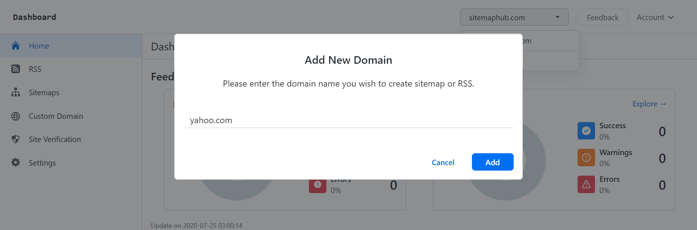

# How to Setup a New Site for My Account

** 1. Log into your SitemapHub account on platform **

** via [https://sitemaphub.com/login](https://sitemaphub.com/login) **

** 2. Then go to the top right hand side on the platform where your domain is being displayed. Click on the drop down box and then select “Add new domain”. like shown below:**

** 3. After you have selected “Add new domain” a pop up should appear. In the blank, enter the domain name of the new site you plan to create sitemap and RSS for this site, then hit “Add” **

** 4. Now that you have your new domain, go to the “Site Verification” page to complete verify your site ownership: **

** Visit : [How to verify site ownership via DNS or HTML file](verify-site-ownership) ** 

### Update or Delete a Site

** Click "Settings" on the left sidebar, update or delete your site. **

