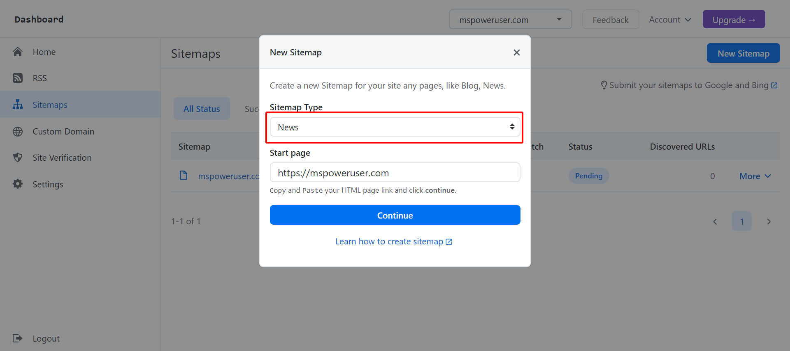
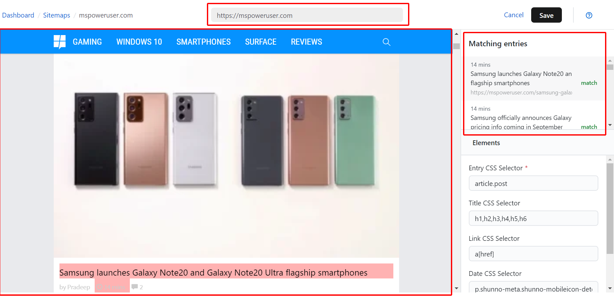
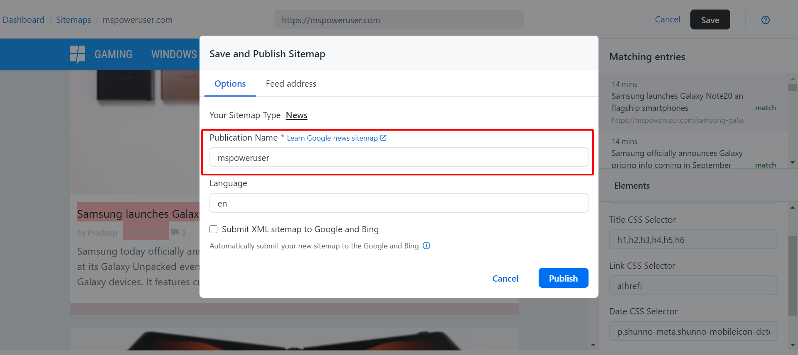
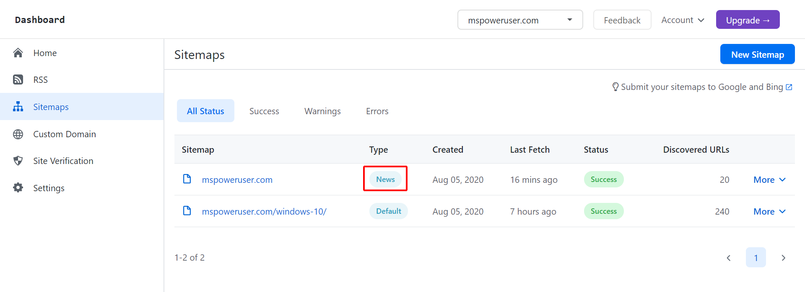

# Create a Google News Sitemap

[Google News sitemap](https://support.google.com/news/publisher-center/answer/9606710?hl=en) is XML file uses the sitemap protocol, lets you control which content you submit to Google News. SitemapHub.com allows your create a Google
News Sitemap, If you are new user, please visit [How to create RSS](create-rss-feed) before.

** 1. Login SitemapHub account on platform.**

** via https://sitemaphub.com/login **

** 2. Then go to the “Sitemap” page and click “New Sitemap”, Select “News” on the "Sitemap Type" list.  **



** 3. Now on the create image sitemap page, select one of the sitemap elements on the “Image Sitemap” area, moving mouse on the “Main Page” area. **



The below table is `CSS Selector` value for each of news sitemap elements.

| Elements      | CSS Selector |
| ----------- | ----------- |
| Entry CSS Selector      | article.post       |
| Title of Image CSS Selector | h1,h2,h3,h4,h5,h6 |
| Link CSS Selector | a[href] |
| Date CSS Selector | p.shunno-meta.shunno-mobileicon-detect |

Notes: According Google news sitemap document, `Date` and `Title` is required.

** 5. Click "Save" on the top of page. On the "Save and Publish Sitemap" pop-up, `Publication Name` and `Language` is required **



- `Publication Name` is the name of the news publication. It must exactly match the name as it appears on your articles on [news.google.com](https://news.google.com), except for anything in parentheses.

-  `Language` is the language of your publication. Use an [ISO 639 language code](https://en.wikipedia.org/wiki/List_of_ISO_639-1_codes)(2 or 3 letters). for example: `en`, `jp`, `zh-cn`,

** 6. Press “Publish” to submit your sitemap. **



**7 . Open this sitemap file in your browser, you can see it now. **

```xml
<urlset xmlns="http://www.sitemaps.org/schemas/sitemap/0.9" xmlns:news="http://www.google.com/schemas/sitemap-news/0.9">
<url>
<loc>https://mspoweruser.com/samsung-galaxy-note20-galaxy-note20-ultra/</loc>
<news:news>
<news:publication>
<news:name>mspoweruser</news:name>
<news:language>en</news:language>
</news:publication>
<news:publication_date>2020-08-05</news:publication_date>
<news:title>
<![CDATA[ Samsung launches Galaxy Note20 and Galaxy Note20 Ultra flagship smartphones ]]>
</news:title>
</news:news>
</url>
<url>
<loc>https://mspoweruser.com/samsung-galaxy-z-fold2-smartphone/</loc>
<news:news>
<news:publication>
<news:name>mspoweruser</news:name>
<news:language>en</news:language>
</news:publication>
<news:publication_date>2020-08-05</news:publication_date>
<news:title>
<![CDATA[ Samsung officially announces Galaxy Z Fold2 smartphone, pricing info coming in September ]]>
</news:title>
</news:news>
</url>
...
```