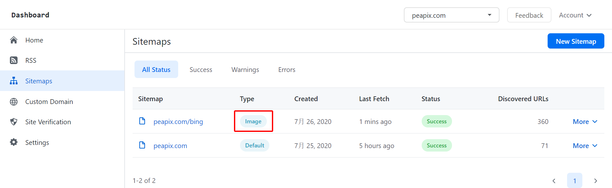

# Create Images Sitemap for Your Site

This article is part of series of how to create XML sitemap.

- [Create a Sitemap](/create-xml-sitemap)
- [Create Videos Sitemap](/create-videos-sitemap)
- [Create Google News Sitemap](/create-google-news-sitemap)

Notes: By default, one item one images.

** 1. Login SitemapHub account on platform. **

via https://sitemaphub.com/Login

** 2. Then go to the “Sitemap” page and click “New Sitemap”. **


** 3. After you have selected “New Sitemap” a pop up should appear. **

** Select "Images" on the "Sitemap Type" list. Enter "https://peapix.com/bing" on the "Start Page". Then hit "Continue"**


** 4. Now on the create image sitemap page, select one of the sitemap elements on the “Image Sitemap” area, moving mouse on the “Main Page” area. **


Here is the each of sitemap elements value.

| Elements      | CSS Selector |
| ----------- | ----------- |
| Entry CSS Selector      | div.p-2.col-md-6       |
| Image CSS Selector   | img[src]        |
| Title of Image CSS Selector | div.image-list-justified__infobar>h4.image-list-justified__title |
| Link CSS Selector | a[href] |
| Paging CSS Selector | div>ul.pagination>li.page-item.PagedList-skipToNext>a.page-link |


** 5. Click "Save" on the top of page. On the "Save and Publish Sitemap" pop up, hit "Publich" to save your sitemap. **


** 6. Now you can see it on the sitemap list page. **



** 7. Open this sitemap file in your browser, you can see it now.**

```xml
<urlset xmlns="http://www.sitemaps.org/schemas/sitemap/0.9" xmlns:image="http://www.google.com/schemas/sitemap-image/1.1">
<url>
<loc>https://peapix.com/bing/31925</loc>
<image:image>
<image:loc>https://img.peapix.com/7f8790d0990b4d09b29b58645cca95ce_480.jpg</image:loc>
<image:title>Tamul waterfall in the state of San Luis Potosí, Mexico</image:title>
</image:image>
</url>
<url>
<loc>https://peapix.com/bing/31932</loc>
<image:image>
<image:loc>https://img.peapix.com/b6cde90b5bd64c61b81472a9b9ee54f4_480.jpg</image:loc>
<image:title>Hamelin Pool Marine Nature Reserve, Shark Bay, Australia</image:title>
</image:image>
</url>
...
</urlset>
```

### Why I can't see my images on the page?

If your are website using "lazy-load images" feature, SitemapHub could be not load your images.

SitemapHub supports `data-src`,`srcset`, `data-srcset` and `data-lazy-srcset` these lazy-load images format. like shown below:

```html
 

```