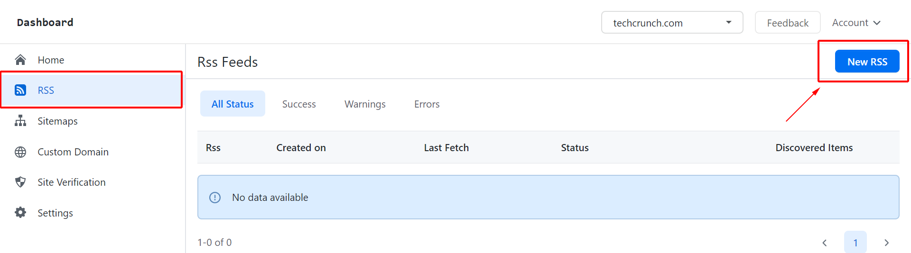
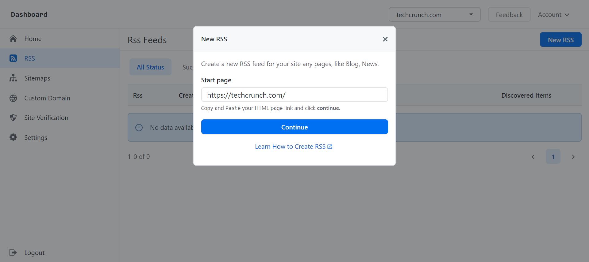
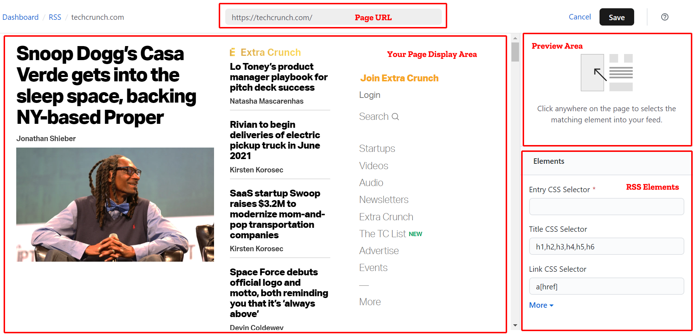
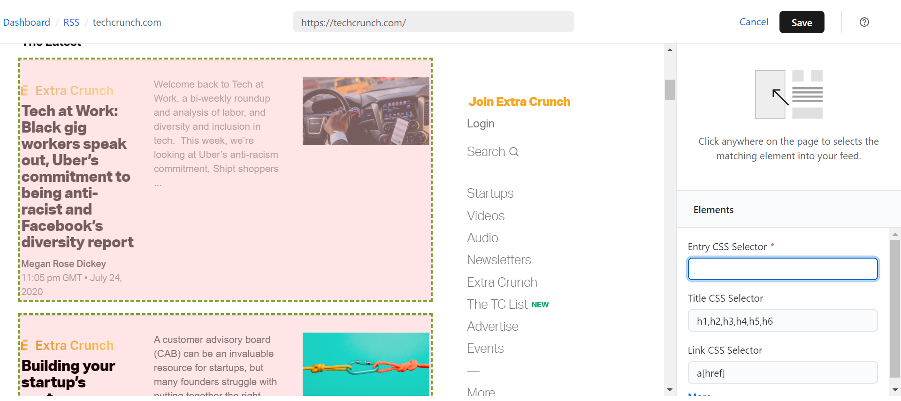
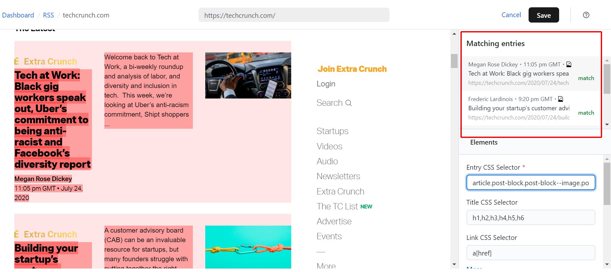
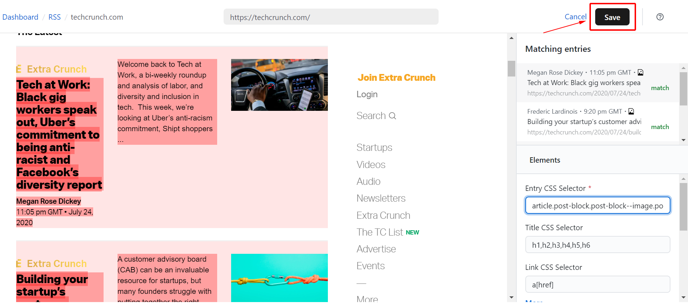
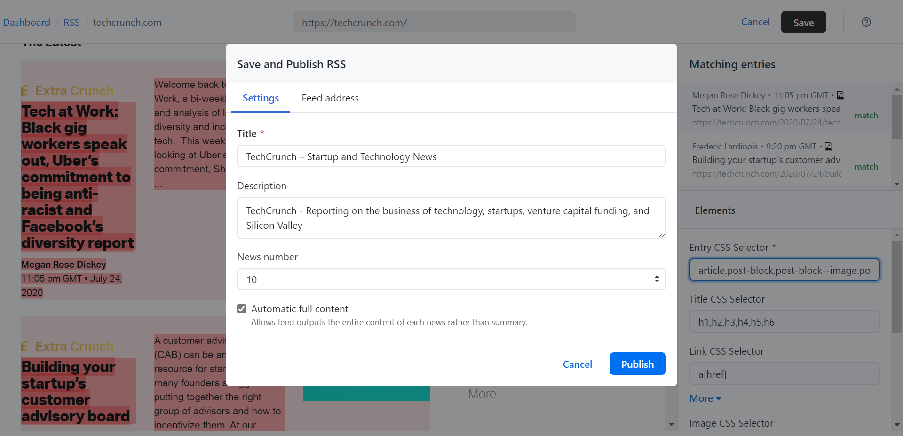
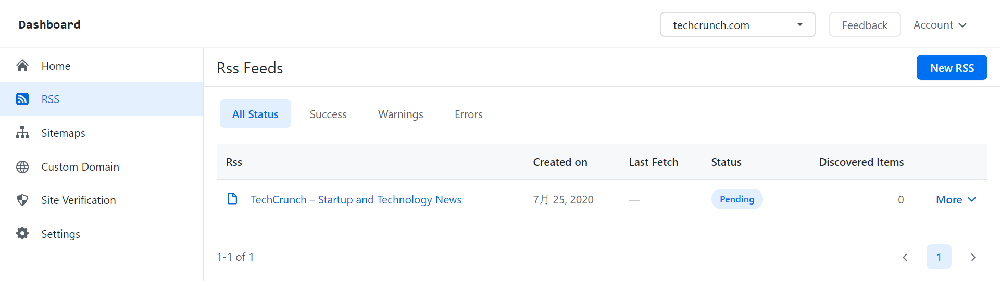
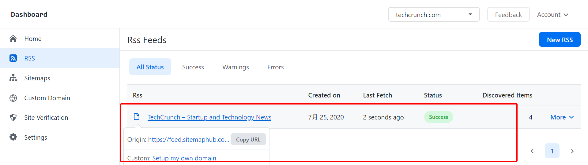

# Create Your first RSS feed Online Without Coding

In this article, we will take tech website **https://techcrunch.com/** as our example how to create RSS feed for techcrunch.com.

** 1. Login SitemapHub account on platform.**

** via https://sitemaphub.com/login **

** 2. Then go to the “RSS“ page and click “New RSS”. **

** 3. After you have selected “New RSS” a pop up should appear. In the blank, enter the page url then hit “Continue” to start. **

** 4. Now that we are go into the create RSS page. **

** 5. Selected “Entry CSS Selector” on the “RSS Elements” area and then moving mouse on the “Main Page Area” **

** 5. Left-click in the selected elements on Main Page area, these content will be to display in your RSS.**

** 6. Then selected another RSS elements on the “RSS Elements”  area and click page elements on “Main Page” area until finished this RSS. **

** 7. When all RSS element done and then hit the “Save” on the top of page。**

** 8. Selected “Save and Publish RSS” pop up should appear。**

** 8. On the “Settings” tab, you can updating your RSS title, description, change the maximum number of items to display. **

if you checked "Automatic full content", Sitemap Hub will try attempt reading the full article for each items and display in the RSS. you can turn off this.

** 9. All done then hit “Save”, your new RSS will display in the RSS list page. ** 

** 10. When your RSS is ready to access, this “Pending” status will become “Success”.**

