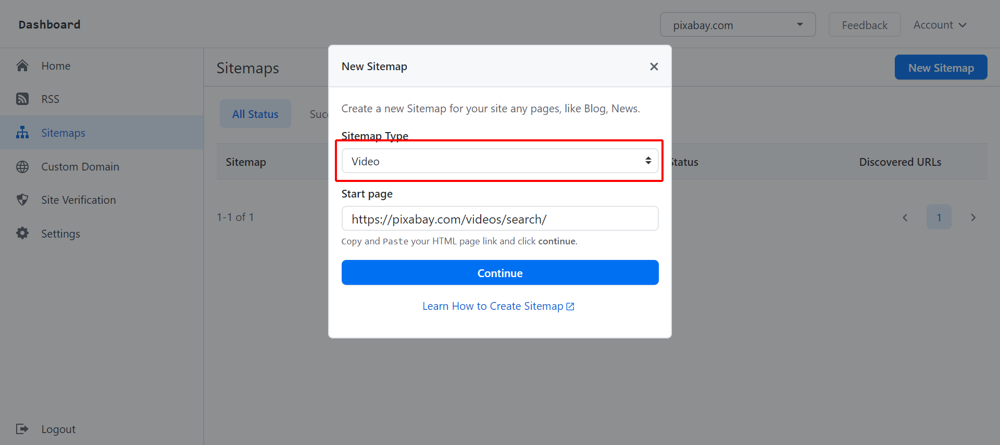

# Create Google Videos Sitemap for Your Site

```
SitemapHub supports the following videos: [VideoObject](https://schema.org/VideoObject) tag, Youtube(coming soon)
```

This article is part of series of how to create XML sitemap.

- [Create a Sitemap](/create-xml-sitemap)
- [Create Images Sitemap](/create-images-sitemap)

** 1. Login SitemapHub account on platform. **

via https://sitemaphub.com/Login

** 2. Then go to the “Sitemap” page and click “New Sitemap”. **


** 3. After you have selected “New Sitemap” a pop up should appear. Select a "Video" on the "Sitemap Type" list. Enter "https://pixabay.com/videos/search/" on the "Start Page". Then hit "Continue"**



** 4. On the create video images page, enter the below `CSS Selector`:

| Elements      | CSS Selector |
| ----------- | ----------- |
| Entry CSS Selector      | div.p-2.col-md-6       |
| Title CSS Selector   | meta[itemprop="name"]       |
| Link CSS Selector | a[href] |
| Thumbnail CSS Selector | img[src] |
| Description CSS Selector | |
| Paging CSS Selector |  |


**5. Click "Save" on the top right of page. publish your video sitemap. **

**6. Waiting SitemapHub to create a video sitemap, this usually will takes minutes to completed. **

```xml
<urlset xmlns="http://www.sitemaps.org/schemas/sitemap/0.9" xmlns:video="http://www.google.com/schemas/sitemap-video/1.1">
<url>
<loc>https://pixabay.com/videos/sea-iceland-ocean-water-sky-33194/</loc>
<video:video>
<video:thumbnail_loc>https://i.vimeocdn.com/video/862586427_640x360.jpg</video:thumbnail_loc>
<video:title>
<![CDATA[ Sea, Iceland, Ocean, Water ]]>
</video:title>
<video:description>
<![CDATA[ Sea, Iceland, Ocean, Water ]]>
</video:description>
<video:content_loc>//player.vimeo.com/external/396036988.hd.mp4?s=d409153a1984fc0bd388cdc8d0a3a94eed888de3&profile_id=174</video:content_loc>
<video:duration>40</video:duration>
</video:video>
</url>
...
</urlset>
```