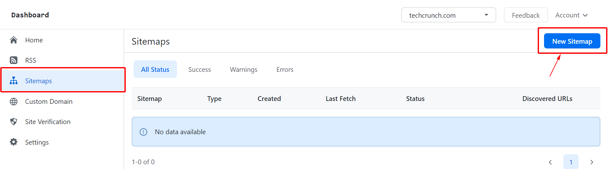
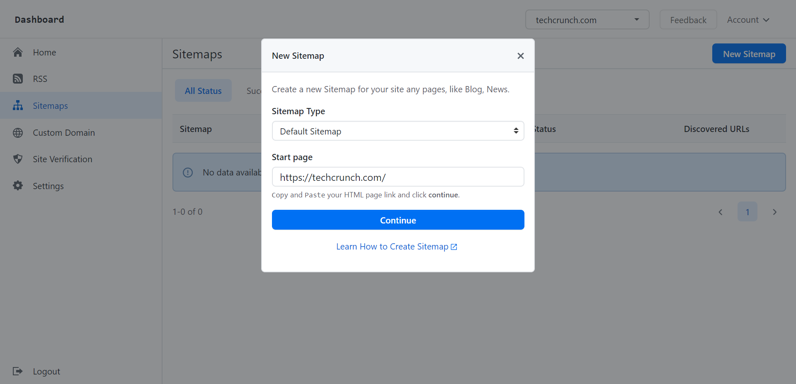
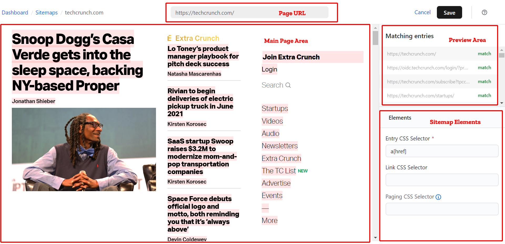
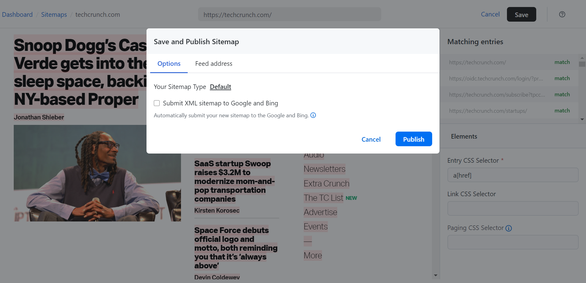
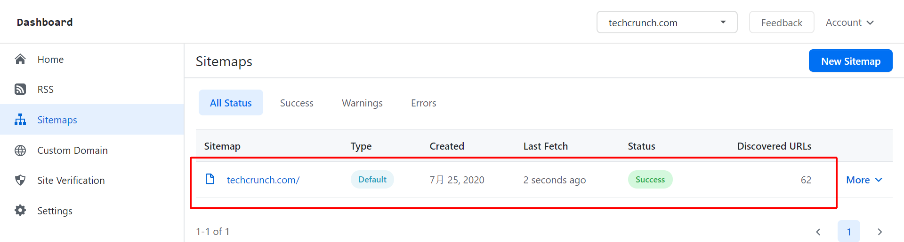

# Create Your first XML Sitemap Online Without Coding

In this article, we will take tech website **https://techcrunch.com/** as our example how to create sitemap for techcrunch.com.

- [Create Images Sitemap](create-images-sitemap)
- [Create Videos Sitemap](create-videos-sitemap)

** 1. Login SitemapHub account on platform.**

** via https://sitemaphub.com/login **

** 2. Then go to the “Sitemap” page and click “New Sitemap”. **

** 3. After you have selected “New Sitemap” a pop up should appear. Selecting your sitemap type and enter the page URL then hit “Continue”.**

** 4. Now that we are go into the create Sitemap page. **

** 5. Selected “Entry CSS Selector” on the “Sitemap Elements” area and then moving mouse on the “Main Page Area”.**

** Custom your sitemap links. You decide which links add into the XML sitemap. You also can keep the default value：“a[href]”.**

Notes: If your souce page has the next page link, you can enable **“Paging CSS Selector”**, that means SitemapHub will auto load the next page
until go the the last page or reached the maximum pages. like the image below:

** 6. Click “Save” button on the top of page to publish your sitemap.**

** 7. On the "Save and Publish Sitemap" dialog, you allows turn on "Submit XML sitemap to Google and Bing" option, automatic submit your sitmap to Google and Bing. **

** We provides a free [Ping tool](https://sitemaphub.com/ping-sitemap), allows your manually submit sitemap via to the multiple search engines. **

** 7. Press “Publish” , your new Sitemap will display in the Sitemap list page.**

Next submit your sitemap to the search engines: [How to submit your sitemap to Google and Bing](submit-your-sitemap-to-google)
