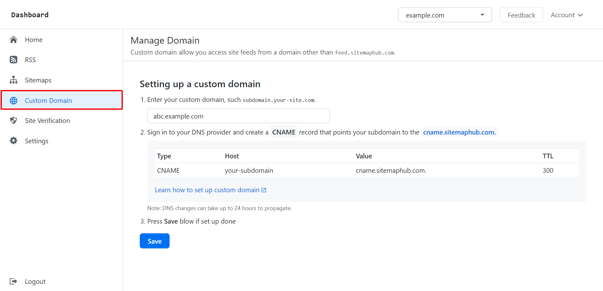
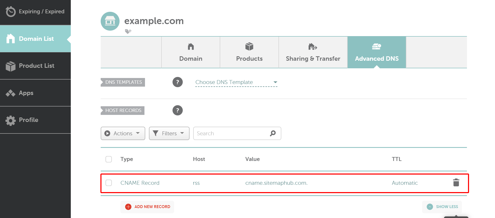
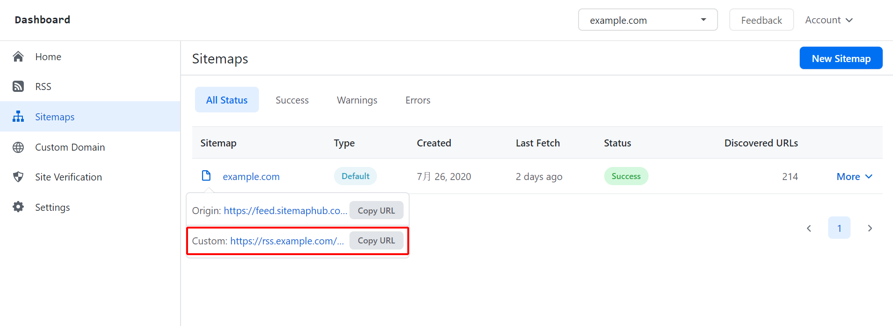

# Setup Custom Domain for Your Sitemaps and RSS 

When your created a new sitemap or RSS for your site, in the default, you only access your feed via https://feed.sitemaphub.com domain.

SitemapHub allows your setting a custom domain to access your sitemaps and RSS, it's better rather than by default. like: “https://your-custom-domain/{name}”

### How to setting up your own branded domain. 

** 1. Log into your SitemapHub account on platform **

** via [https://sitemaphub.com/login](https://sitemaphub.com/login) **

** 2. Go to the “Custom Domains” page. **

** 3. Enter your domain/subdomain name want to bind in the text control. **

** 3. Log into your domain name provider and add the CNAME record.**

- Sign in to your domain host account.
- Go to your domain’s DNS records. The page might be called something like “DNS Management”, “Name Server Management”, “Control Panel”, or "Advanced Settings".
- Select the option to add a new record. For the record type, select **CNAME** type.
- In the **Name/Host/Alias** field, enter **<u>you-domain-name</u>**.
- In the **Time to Live (TTL)** field, enter **86400** or leave the default.
- In the **Value/Answer/Destination** field, enter **<u>my.sitemaphub.com</u>**.
- Save the record.

(namecheap.com)

Note: The CNAME record take up to 48 hours to take effect, but they often take effect much sooner(usually takes 3-5 minutes). 

** 4. Click “Save” if set up done.**

When you setup your custom domain successfully, It will display on the Sitemap list page and RSS list page.

## SSL Certificate

** After you've correctly configured a DNS record, we will attempt to generate an SSL certification on your behalf! **

** SitemapHub using [Let's Encrypt](https://letsencrypt.org/) to creating an SSL certificate for your domain, and automatic renewal until you cancel this custom domain. **

Notes: If you get an SSL certificate error when access on the web browser, please try to delete this custom domain and add it again.
