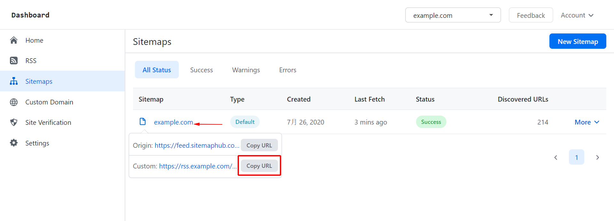
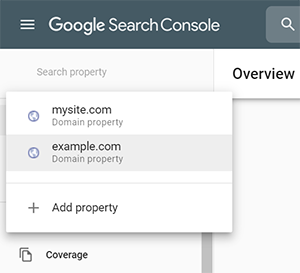
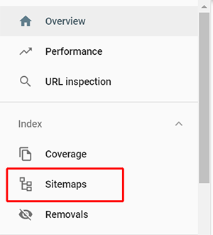
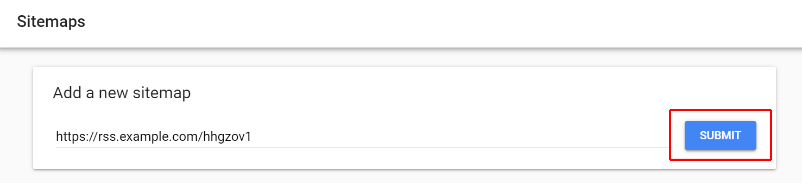
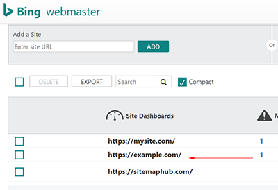
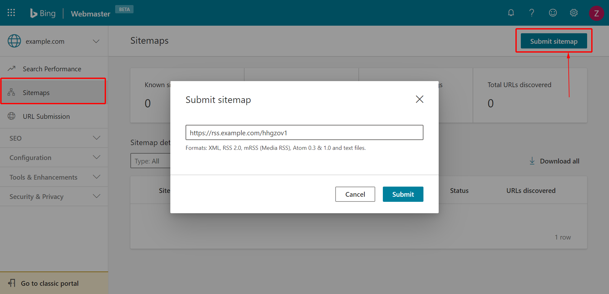

# Submit your Sitemaps to Google and Bing

### How to Get your sitemap URL on SitemapHub

Before your submit your sitemap to google, your should get your sitemap URL.

**1. Login SitemapHub account on platform **

via https://sitemaphub.com/Login

**2. Go to the "Sitemaps" list page, then select your sitemap on the sitemaps list **

Move the mouse to the sitemap title, will list this sitemap file URLs . [How to set up custom domain](/setting-custom-domain)

**3. Click on "Copy URL" to copy this sitemap URL. **

## How to Submit your Sitemap to Google Search Console

** Step 1: Login to google search Console **

via https://search.google.com/search-console

** Step 2: In the sidebar, Select your website. **

** Step 3: Click on "Sitemaps" ** on the left sidebar. **

** Step 4: On the Sitemaps page on Google search console. Enter you copied sitemap URL that get on the previous step. **

** Step 5: Click on "Submit" to submit your sitemap to Google. **

Note: if your site is the Site property on Google search console, you cannot submit a full sitemap URL. Please add domain property. [Add a website property on Google Search Console](https://support.google.com/webmasters/answer/34592?hl=en)

## How to Submit your Sitemap to Bing

** Step 1: Login to Bing Webmaster Tools. **

via https://www.bing.com/toolbox/webmaster

** Step 2: Select your website on the "My Sites" list. **

If there is no website display, please create one for your sitemap.

** Step 3: In the left sidebar, select "Sitemsps" under the "Configure My Site". **

or you go to the new version of Bing Sitemaps Tools via https://www.bing.com/webmasters/sitemaps

** Step 4: On the sitemaps page, Click "Submit sitemap" then enter your copied sitemap URL. **

** Step 5: Click on "Submit" to submit sitemap to Bing. **

