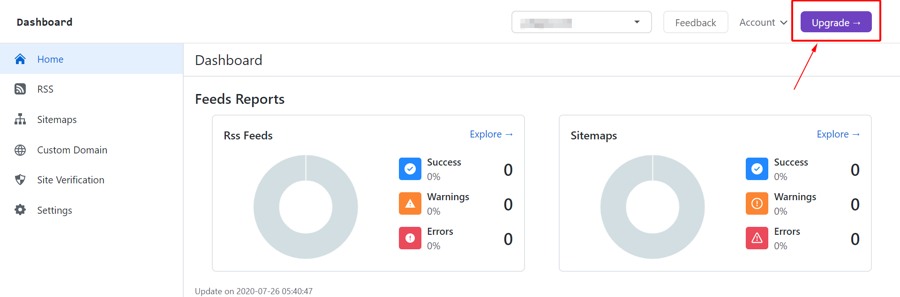
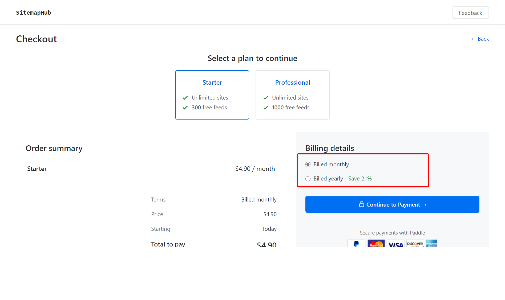
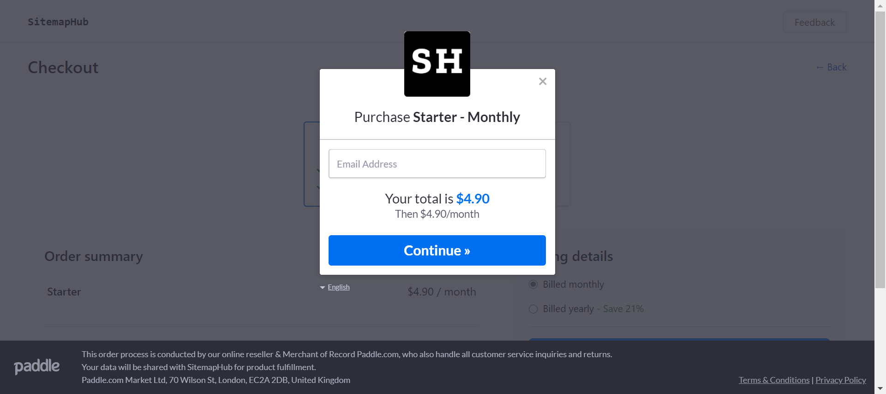
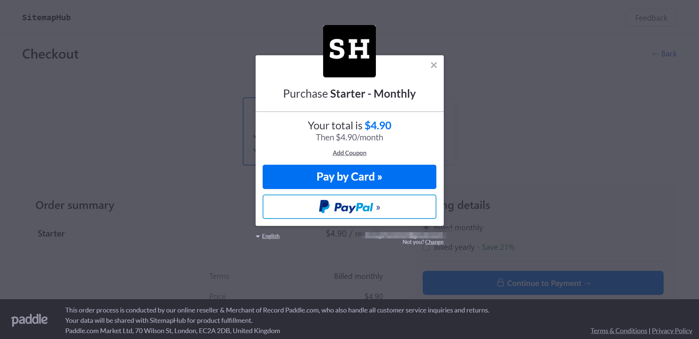
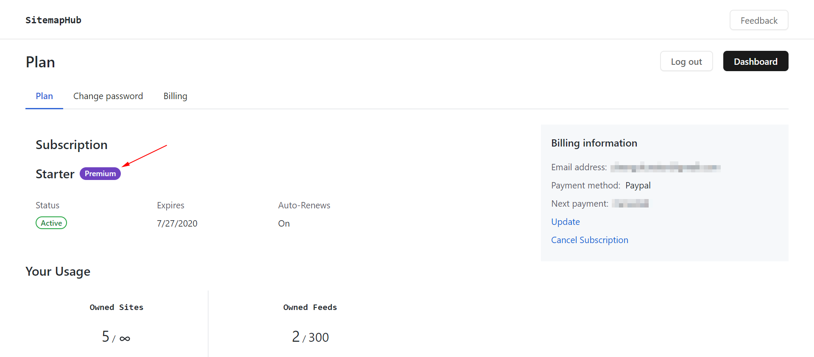
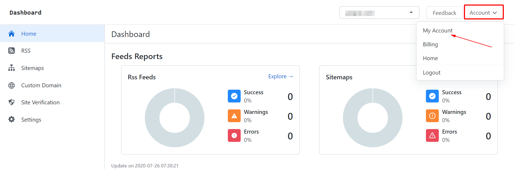
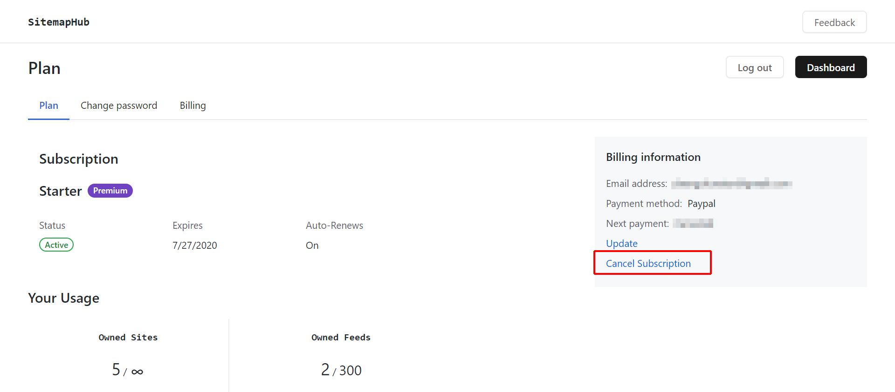

# Subscription Plan and Billing

By default, you have a 15-days free trial plan。, When your trial plan are expired, you will need to upgrade your subscription plan. 

You can cancel your subscription any time.

## Upgrade your Subscription Plan

1. Log into your SitemapHub account on platform

via https://sitemaphub.com/login

2. Click "Upgrade" on the top right of page or on the “Account” page. like show below:

3. Select your subscription plan and payment on the checkout page. Then hit "Continue to payment".

4. On the payment dialog, you can change language for dialog UI. enter your email to receive an order details. then next.

5. Slect one of the payment methods: Paypal, Cred Card.

6. When you complete the payment, your subscription plan will be activated immediately. If the payment is successful but not effective, please contact us.

You can see your order on the https://sitemaphub.com/account/billing and download your invoice.

## Cancel your Subscription

1. Login your SitemapHub account on the platform.

2. Go to the “Account” page on the top right Account drop down box.

2. Then click "Cancel Subscription" link on the "Billing information" area. like shown below:

## How to Refund

We offer free refund within 7 days, no charge.

If you're not satisfied after paid, you can send email to **support@sitemaphub.com** and with your email(peyment email address) and subscription plan.

Processing a refund request usually take 2-3 working days, then back money to your bank account.

- PayPal refunds within 48 hours.

- Refunds via credit card typically take 3-5 working days.

