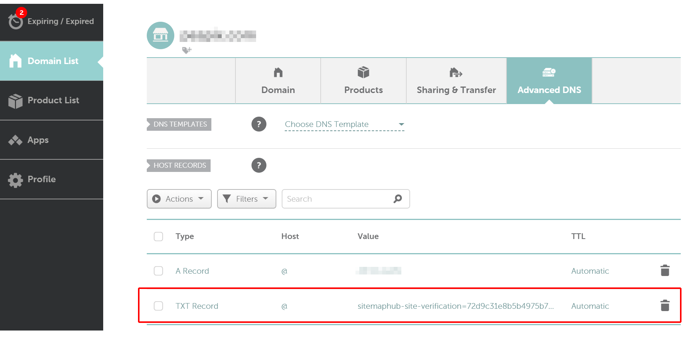

# How to Verify Ownership of Your Site

When you add a new site to your account,see [How to add a new site](/add-new-site), you need to verify that you own the site by proving ownership. Currently we provide 2 methods to verify ownership of your site:

- DNS record (recommended): this method requires that you add a verification txt record to your domain's DNS settings.

- HTML file:  this method requires you to download the HTML verification file and upload it to your domain's root folder.

** 1. Log into your SitemapHub account. **

Go to https://sitemaphub.com/login and log into your SitemapHub platform account.

** 2. Then click and go to the “Site Verification” page on the left hand side. **

## Verifing Ownership via DNS record

** 1. Selected “DNS TXT Record” tab on the page and then copy the TXT record, like the below. **

** 2. Add the TXT record to your domain host provider.**

- Sign in to your domain host account.
- Go to your domain’s DNS records. The page might be called something like “DNS Management”, “Name Server Management”, “Control Panel”, or "Advanced Settings".
- Select the option to add a new record. For the record type, select **TXT**.
- In the **Name/Host/Alias** field, enter @ or leave it blank.
- In the **Time to Live (TTL)** field, enter **86400** or leave the default.
- In the **Value/Answer/Destination** field, paste the verification TXT record you copied.
- Save the record.

(namecheap.com)

Note: The TXT record take up to 48 hours to take effect, but they often take effect much sooner(usually takes 3-5 minutes). 

** In the table below, list the most popular domain name provider and with how to add TXT record link.**

- [name.com](https://www.name.com/support/articles/115004972547-Adding-a-TXT-Record)
- [namecheap.com](https://www.namecheap.com/support/knowledgebase/article.aspx/317/2237/how-do-i-add-txtspfdkimdmarc-records-for-my-domain)
- [godaddy.com](https://www.godaddy.com/help/add-a-txt-record-19232)
- [aliyun.com](https://help.aliyun.com/knowledge_detail/29725.html#h2-txt-5)
- [cloudflare.com](https://support.cloudflare.com/hc/en-us/articles/360019093151-Managing-DNS-records-in-Cloudflare)

** 3. Click “Verify” when all done.**

## Verifing Ownership via HTML file

** 1. Selected “HTML Verification File” tab on the page and then download the verification HTML file, see the below image. **

** 2. Upload the HTML file to your domain's root folder or another folder. **

** 3. Enter the HTML file URL address on the input control.**

You should confirm successful upload by visiting **https://{your-domain}/sitemaphub-verification.html** in your browser before into the next step.

** 4. Click “Verify” .**

Once we are successfully verified your site ownership, “UNVERIFIED” will became “VERIFIED” and display on your page.

Next [How to setting up custom domain](/setting-custom-domain)